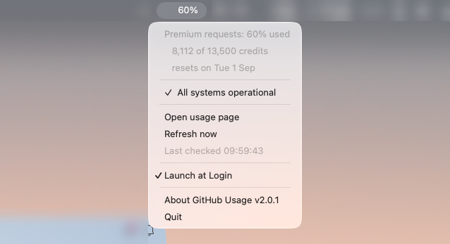

# GitHub Usage — macOS menu-bar meter

A tiny menu-bar app with two jobs: it shows how much of your **Copilot
premium-request allowance** is spent, and it tells you when **GitHub is having an
incident**.

```
6%        ← premium requests used this period; text only, nothing else
●  6%     ← blinking red: GitHub has an ongoing incident
```

Nothing but the number when all is well, matching the sibling
[claude-usage](https://github.com/lobner/claude-usage) app, so the two read as a
pair and neither shouts for attention until something is wrong.

## Copilot premium requests

The menu-bar title is the percentage of your premium-request credits used in the
current billing period, and the top of the dropdown spells it out:

```
Premium requests: 6% used
   855 of 13,500 credits
   resets on 1 Sep
```

Once usage first reaches `ALERT_PERCENT` (80% by default) you get a Notification
Centre banner, re-armed after each monthly reset. On a plan with no metered
premium requests the row reads *unlimited on this plan* and the percentage stays
out of the menu bar entirely.

The numbers come from `https://api.github.com/copilot_internal/user`, the internal
endpoint the editor extensions call for "premium requests remaining" — there is no
documented API for this, so treat the shape as observed rather than contractual.
It authenticates with the token the **GitHub CLI** has already stored, or with
`GH_TOKEN`/`GITHUB_TOKEN` if either is set; it never writes, refreshes, or logs a
token. Without a usable token the title shows `⚠` and the row says which of the
two problems it is — no CLI, or a CLI with nothing stored.

The CLI's token is looked for in three ways, in order: `gh auth token` with `gh`
found at an absolute path, then the keychain item `gh:github.com`, then
`~/.config/gh/hosts.yml`. That matters because an app launched by Finder or at
login inherits a minimal `PATH` that excludes Homebrew — so asking for `gh` by
name alone works in a terminal and fails in the built app.

## Incidents

Ongoing incidents are signalled in the icon, never by growing the menu bar:

- **All clear** → no dot, just the percentage (stays out of the way).
- **New incident** → a **red dot appears and blinks** until you look at it.
- **Acknowledged** → opening the menu stops the blinking and leaves the **dot
  solid** for as long as the incident is ongoing. The incident's newest update is
  read in the dropdown itself. A later, different incident starts the blinking
  again.

The dot's slot is always there, holding a transparent image of the same size
whenever the dot is not lit. Dropping the image instead would narrow the status
item, dragging the percentage — and every menu-bar item to its left — sideways
twice a second while blinking, and again whenever an incident starts or ends.
- A **Notification Centre banner** when a *new* incident first appears while the
  app is running.



The dropdown lists each ongoing incident as **what its newest update actually
says** — `Update — We are experiencing degraded availability for chat & agent
models in Copilot…` — rather than the generic entry title ("Incident with
Copilot"), which repeats what the icon has already told you. Long messages are cut
at a word boundary and the tooltip carries the title and the whole update. Click a
row to open that incident. The status headline itself opens
[githubstatus.com](https://www.githubstatus.com). Below the list: *Open usage
page*, *Refresh now*, the last-checked time, *Launch at Login*, *About*, and
*Quit*.

The **About** row names the build — `About GitHub Usage v2.0.0` — and opens that
version's release notes when clicked. Its tooltip carries the commit, the build
date and the architecture, which is what a bug report actually needs: the released
archives are Apple silicon only, and these builds are unsigned, so "which build is
that?" is otherwise unanswerable. `make-app.sh` stamps all three in from
`git describe`, so an untagged build says `v1.2.0-3-g1a2b3c4` and a dirty tree says
`-dirty`; `go run .` says `dev`.

## How it decides "ongoing"

It polls `https://www.githubstatus.com/history.atom` (every 60 s by default).
Each `<entry>` is an incident whose update history is newest-first, each update
tagged `<strong>Investigating | Identified | Update | Monitoring | Resolved</strong>`
(maintenance uses `Scheduled | In progress | Completed`). An incident is
**ongoing** iff its newest label is **not** `Resolved`/`Completed`. Polling uses
a conditional `If-None-Match` request, so unchanged feeds cost a cheap `304`.

## Build & run

Requires Go 1.22+ (this repo pins `golang 1.25.11` via `.tool-versions`).

```sh
# Run in the foreground (Ctrl-C to stop):
go run .

# Build the .app, and let it offer to install:
./build/make-app.sh
```

`make-app.sh` produces `GitHub Usage.app` with `LSUIElement=true`, so it runs as a
menu-bar-only agent (no Dock icon) and survives closing the terminal. After
building it asks *"Install to /Applications and relaunch?"*, which quits whichever
copy is running (the installed one or one launched from this repo — they share a
bundle id), replaces the bundle, and reopens it from `/Applications`. Pass
`--install` or `--no-install` to answer up front; with no terminal on stdin it
builds and stops rather than touching `/Applications`.

Installing this way is worth preferring, because *Launch at Login* records the
bundle by the path it was registered from — see below.

## Configuration

| Env var         | Default                                       | Meaning                                  |
| --------------- | --------------------------------------------- | ---------------------------------------- |
| `FEED_URL`      | `https://www.githubstatus.com/history.atom`   | Incident feed to poll. A `file://…` path also works (handy for testing). |
| `COPILOT_URL`   | `https://api.github.com/copilot_internal/user` | Copilot entitlement endpoint. A `file://…` path also works. |
| `POLL_SECONDS`  | `60`                                          | Polling interval in seconds (min 10).    |
| `ALERT_PERCENT` | `80`                                          | Banner when premium-request usage first reaches this %. `0` disables it. |
| `GH_TOKEN`      | —                                             | Token to use instead of the GitHub CLI's stored one. `GITHUB_TOKEN` also works. |

## Launch at login

The app offers this itself: the first time you run it from the `.app` bundle it
asks *"Launch GitHub Usage at login?"*, and choosing **Launch at Login**
registers the bundle as a login item via `SMAppService` (macOS 13+). It then
appears under System Settings → General → Login Items → **Open at Login**, and
you can switch it off there.

Register the copy that is going to stay put — macOS remembers the bundle by the
path it was registered from, so install to `/Applications` *first* and answer the
prompt from that copy. Answering it from the repo build means the next
`make-app.sh` (which does `rm -rf` on the bundle) leaves a dangling login item.

The offer is made once, either way. The answer is remembered in
`~/Library/Application Support/dk.biq.githubstatus/launch-at-login`; delete that
file to be asked again. It is also skipped when the binary isn't running from a
bundle (`go run .`), since login items are bundles.

That path still says `githubstatus` on purpose. The app was called **GitHub
Status** until v1.2.0, and the bundle id is its identity to macOS: keeping
`dk.biq.githubstatus` is what lets the existing *Open at Login* registration and
your recorded answer survive the rename. Changing it would orphan the login item
and re-prompt everyone, for a string nobody sees.

Each launch also *reconciles*: if the record says registered, the app registers
again. That is a no-op when it already is, and it repairs the case where the login
item was dropped — which happens whenever the bundle is replaced, as
`make-app.sh --install` does. If macOS instead reports the item as switched off,
that is left alone: it means someone turned it off in System Settings, and the
checkbox will show unticked until you tick it again.

Three notes on the mechanics:

- **The bundle is ad-hoc signed with its own identifier.** The Go linker already
  ad-hoc signs, but it calls every binary it produces `a.out`, and macOS keys
  login items by signing identity — so two unsigned Go apps look like one item and
  registering either one evicts the other's *Open at Login* entry. `make-app.sh`
  runs `codesign --sign - --identifier <bundle id>` to give each build a distinct,
  stable identity. That buys identity, not trust: these builds are still not
  Developer ID signed and not notarised.

- A launchd job in `~/Library/LaunchAgents` also starts the app at login, but
  macOS classifies it as a *background item*, so it shows up under **App
  Background Activity** instead — labelled "Item from unidentified developer",
  since these builds are unsigned. `build/dk.biq.githubstatus.plist` is kept as
  that manual alternative.
- `SMAppService.mainApp.status` cannot be used to decide whether to ask: it
  reports `enabled` for a bundle that has *never* been registered, and only says
  `notRegistered` once something has explicitly unregistered it. Hence the local
  state file above.

To set it up by hand instead:

- **Login Items** — System Settings → General → Login Items → add
  `GitHub Usage.app`; or
- **LaunchAgent** — copy `build/dk.biq.githubstatus.plist` to
  `~/Library/LaunchAgents/`, fix the path inside if the app isn't in
  `/Applications`, then `launchctl load ~/Library/LaunchAgents/dk.biq.githubstatus.plist`.

## Project layout

```
main.go                 systray wiring, poll loop, menu, notifications
internal/credits/       Copilot premium-request quota from copilot_internal/user
internal/feed/          fetch (conditional GET) + parse Atom + Ongoing() filter
internal/icon/          the red incident dot, drawn programmatically (no binary assets)
internal/login/         open-at-login registration via SMAppService (cgo)
internal/notify/        Notification Centre banner + confirm dialog via osascript
build/                  Info.plist, make-app.sh, LaunchAgent plist
third_party/systray/    vendored fork of fyne.io/systray (see below)
```

The app pins a **local fork of `fyne.io/systray`** under `third_party/systray`,
wired in via a `replace` directive in `go.mod`. The only change is a one-method
patch to `show_menu` in `systray_darwin.m`: it attaches the menu to the status
item and triggers it via the button so AppKit positions the dropdown directly
below the menu bar. Upstream pops the menu at the button's zero origin, which
renders it *over* the menu-bar icons until a mouse move forces a relayout. To
re-sync the fork to a newer upstream, re-copy it from the module cache and
re-apply that patch.

## Testing

```sh
go test ./...                                              # unit tests (offline)

# Diagnostics (build-tagged, opt-in):
go test -tags livetest -run TestLive -v ./internal/feed    # hit the real feed, list ongoing incidents
ICON_DUMP_DIR=/tmp go test -tags dumpicons ./internal/icon # write the icons to /tmp to eyeball them
```

## Notes & possible extensions

- The first poll only establishes a baseline, so launching during an existing
  incident blinks the icon but does not fire a banner; banners fire for
  incidents that appear afterwards.
- Severity-based colouring (minor/major/critical) and per-component filtering
  (alert only when e.g. Actions or Copilot is affected) would need GitHub's JSON
  APIs (`/api/v2/status.json`, `/api/v2/incidents/unresolved.json`); the feed
  layer is isolated in `internal/feed` so swapping the source is straightforward.

## License

This project is licensed under the [MIT License](LICENSE).

It vendors a fork of [`fyne.io/systray`](https://github.com/fyne-io/systray)
under `third_party/systray/`, which is licensed under the Apache License 2.0 and
retains its own [`LICENSE`](third_party/systray/LICENSE).
